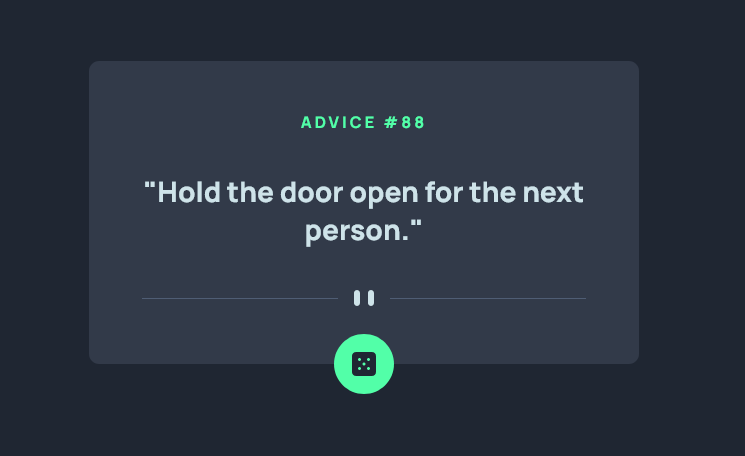

This is a solution to the [Advice generator app challenge on Frontend Mentor](https://www.frontendmentor.io/challenges/advice-generator-app-QdUG-13db).

## Table of contents

- [Overview](#overview)
  - [The challenge](#the-challenge)
  - [Screenshot](#screenshot)
  - [Links](#links)
- [My process](#my-process)
  - [Built with](#built-with)
  - [What I learned](#what-i-learned)

## Overview

### The challenge

Users should be able to:

- View the optimal layout for the app depending on their device's screen size
- See hover states for all interactive elements on the page
- Generate a new piece of advice by clicking the dice icon

### Screenshot

### Links

- [Solution Repository](https://github.com/humbruno/advice-generator-api)
- [Live Site URL](https://humbruno.github.io/advice-generator-api/)

## My process

### Built with

- Semantic HTML5 markup
- CSS custom properties
- Flexbox
- Mobile-first workflow
- [Advice Slip API](https://api.adviceslip.com/) using Fetch and Async functions

### What I learned

This project was a great way to put into practice my JavaScript skills by handling promises.

Async functions are incredibly simple yet powerful to use, and certainly a good solution to "callback hell"!

I also tried the same solution using `.then` and `.catch` without the async functions which achieved the same results. I am not yet sure when to choose one over the other. Definitely something to do more research on!
